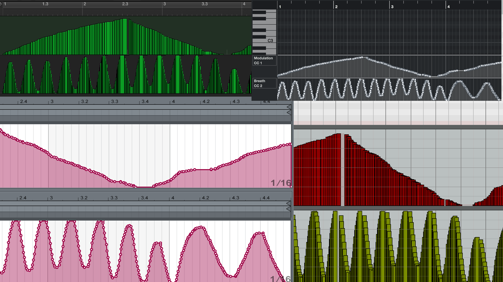
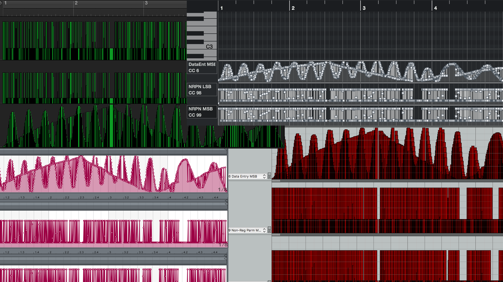

# nrpnBridge
midi nrpn and rpn editing in modern sequencers is very(!) difficult - let's fix that

# How to use the tools

The bridge translates NRPN controllers for easier editing.

1. If you do not already have it, download Cycling74 MaxMSP (the free demo is sufficient to use these tools) 
2. Download and open the "main.maxpat" file to start the bridge.
3. Define your desired controllers for bridging.
4. Select a MIDI input and output in the bridge. The "to MaxMSP" and "from MaxMSP" virtual ports may be useful here.
5. Select the bridge input and output in your sequencer.
6. Enjoy!

# Problem specification

Many popular MIDI sequencers provide graphical views of parameter data. NRPN and RPN support is poorly displayed.

These tools transform data into a form that most sequencers display more easily. The conversion is 100% accurate, seamless, and simple.
It would, of course, be even simpler if manufactuers would add proper support. I have been waiting for over 20 years for some. They have not.

The [CC example file](example_MIDI/example_CC1_2.mid) contains a four bar sequence with two CC parameters rising and falling.
Apple Logic, Cockos Reaper, Steinberg Cubase, Ableton Live, Avid Protools display the sequence like this. This is no problem.



The [NRPN example file](example_MIDI/example_NRPN1_2.mid) contains a four bar sequence with two NRPN parameters rising and falling.
Apple Logic, Cockos Reaper, Steinberg Cubase, Ableton Live, Avid Protools display the sequence like this. **This is very much a problem!**



The bridge translates NRPN data for easier editing.

# Background context

The MIDI protocol offers three common mechanisms for controlling MIDI hardware and software:
1. System exclusive
    - Messaging system not used here
    
2. Continuous Controllers (CC)
    - Parameters indexed by numbers 0-127
    - Manufactuers assign meaning to each numbered control
    - Common performance controls include MODWHEEL=1, EXPRESSION=11, SUSTAIN_PEDAL=64
  
3. Registered Parameter Numbers, and Non Registered Parameter Numbers (RPN and NRPN)
    - Messaging system built "on top of" CC system (see above)
    - Parameters indexed by numbers 0-16383
    - Manufacturers assign meaning to each numbered control 
    - RPNs are few, Midi Manufacturers Association maintains common register 
    - NRPNs can be numerous, you must dig (in manuals) to find info

# Techncical information

NRPN and RPN data and value is 12 bytes (4 x 3byte).
Sequencing of the messaging is important. Most parsers in hardware and software rely on the sequence 99,98,06,38.

```
099 MSB NRPN
098 LSB NRPN
006 MSB VALUE 
038 LSB VALUE
```
